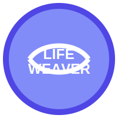
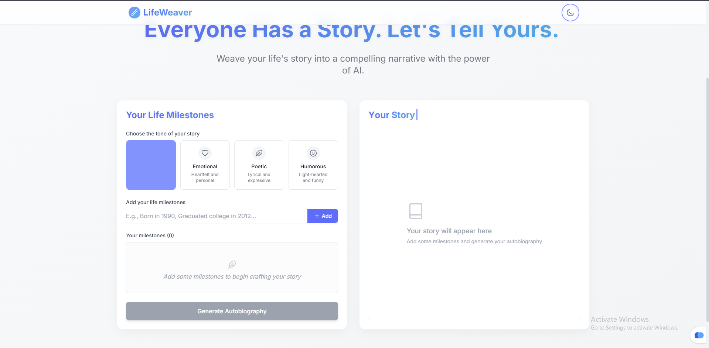
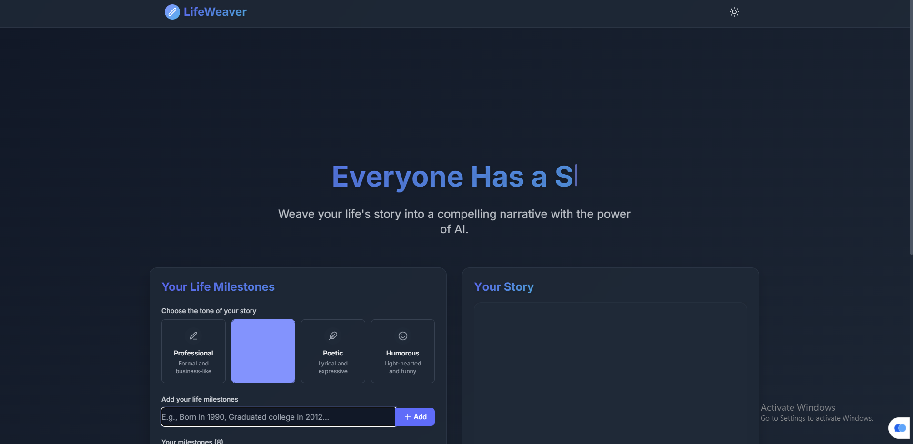
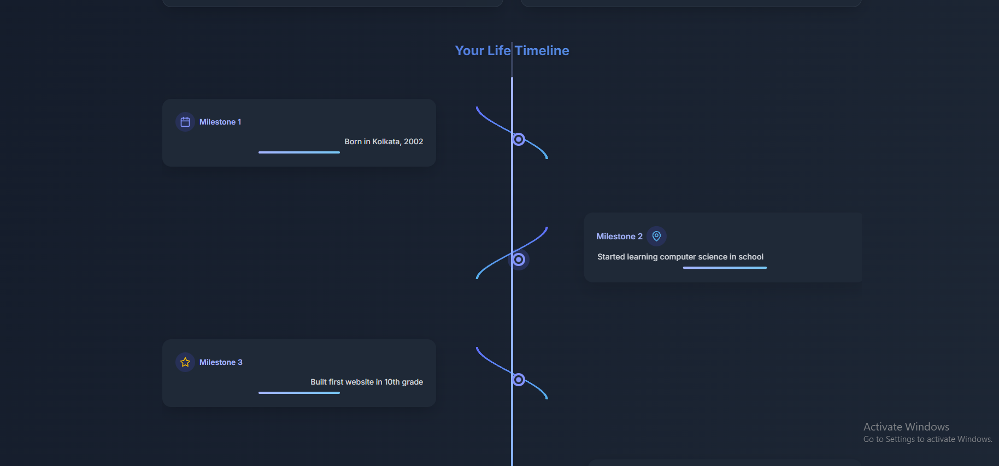
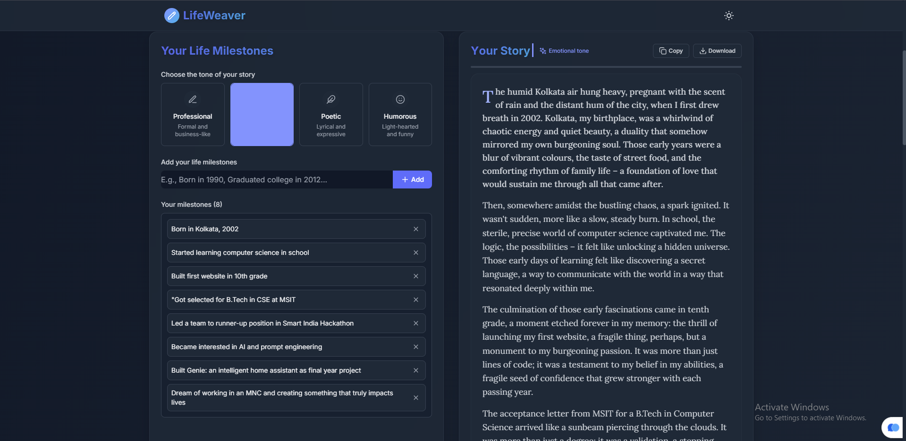

# LifeWeaver - AI Autobiography Generator

<div align="center">
  
  <br>
  <p>
    <strong>Transform your life milestones into beautiful stories with AI</strong>
  </p>
  <p>
    <a href="#features">Features</a> •
    <a href="#screenshots">Screenshots</a> •
    <a href="#demo">Live Demo</a> •
    <a href="#tech-stack">Tech Stack</a> •
    <a href="#installation">Installation</a> •
    <a href="#usage">Usage</a> •
    <a href="#license">License</a>
  </p>
  
  
  
  
  [](https://www.python.org/)
  [](https://reactjs.org/)
</div>

## Overview

LifeWeaver is a sophisticated web application that helps users generate personalized autobiographies based on their life milestones and preferred tone. Powered by Google's Gemini AI, it creates compelling narratives that weave together your life experiences into a coherent story.

The application features a modern, responsive interface with elegant animations and a clean design, making it easy and enjoyable to use. It supports multiple tones for story generation, allowing users to customize the feel of their autobiographies.

## Features

- ✨ **Intuitive Milestone Input** - Add your life's key events one by one with a friendly interface
- 🎭 **Multiple Tones** - Choose from Professional, Emotional, Poetic, or Humorous styles
- ⚡ **Real-time Generation** - Create your autobiography instantly with powerful AI
- 🌓 **Light/Dark Mode** - Comfortable viewing experience in any environment
- 📱 **Responsive Design** - Works perfectly on desktop, tablet, and mobile
- 🔄 **Interactive Timeline** - Visualize your life events in a beautiful timeline
- 💾 **Export Options** - Copy or download your generated story with one click
- ✨ **Smooth Animations** - Delightful user experience with subtle motion effects

## Screenshots

<div align="center">
  
  
  <p><em>Light and Dark mode interfaces</em></p>
  
  
  <p><em>Interactive timeline view of life events</em></p>
  
  
  <p><em>Generated autobiography with export options</em></p>
</div>

## Tech Stack

### Frontend
- **React 18** - Modern component-based UI library
- **TypeScript** - Type-safe JavaScript
- **TailwindCSS** - Utility-first CSS framework
- **Framer Motion** - Powerful animation library
- **Lucide Icons** - Beautiful, consistent icons
- **React Hooks** - Functional component state management

### Backend
- **Python 3.9+** - Latest Python features
- **Flask** - Lightweight web framework
- **Google Gemini API** - State-of-the-art AI model
- **RESTful API** - Clean architecture for data exchange
- **Environment Variables** - Secure configuration management

## Installation

### Prerequisites
- Node.js (v16+)
- NPM or Yarn
- Python 3.9+
- Google Gemini API key

### Clone Repository
```bash
git clone https://github.com/NeelajDebnath/lifeweaver.git
cd lifeweaver
```

### One-Click Setup
Use the provided setup scripts:

For Windows:
```
.\start.bat
```

For PowerShell:
```
.\start.ps1
```

### Manual Setup

#### Backend Setup

1. Navigate to the backend directory:
   ```bash
   cd lifeweaver/backend
   ```

2. Create and activate a virtual environment:
   ```bash
   python -m venv venv
   venv\Scripts\activate  # On Windows
   source venv/bin/activate  # On Unix/MacOS
   ```

3. Install dependencies:
   ```bash
   pip install -r requirements.txt
   ```

4. Set up your environment variables by creating a `.env` file:
   ```
   GOOGLE_API_KEY=your_api_key_here
   ```

5. Run the Flask server:
   ```bash
   python app.py
   ```
   The server will start at `http://localhost:5000`

#### Frontend Setup

1. Navigate to the frontend directory:
   ```bash
   cd lifeweaver/frontend
   ```

2. Install dependencies:
   ```bash
   npm install
   # or
   yarn install
   ```

3. Start the development server:
   ```bash
   npm start
   # or
   yarn start
   ```
   The application will open at `http://localhost:3000`

## Usage

1. **Add Milestones**: Enter significant events from your life (e.g., "Born in London, 1990", "Graduated from university with honors in 2014")

2. **Select a Tone**: Choose how you want your story to sound:
   - **Professional**: Straightforward and formal
   - **Emotional**: Heartfelt and reflective
   - **Poetic**: Artistic and metaphorical
   - **Humorous**: Light-hearted and witty

3. **Generate**: Click the "Generate Autobiography" button to create your story

4. **Review**: Read through your personalized autobiography

5. **Export**: Copy to clipboard or download as a text file

6. **Timeline**: Explore the visual representation of your life journey

## Contributing

Contributions are welcome! Please feel free to submit a Pull Request.

1. Fork the repository
2. Create your feature branch (`git checkout -b feature/amazing-feature`)
3. Commit your changes (`git commit -m 'Add some amazing feature'`)
4. Push to the branch (`git push origin feature/amazing-feature`)
5. Open a Pull Request

## License

This project is licensed under the MIT License - see the [LICENSE](LICENSE) file for details.

## Acknowledgments

- [Google Gemini AI](https://deepmind.google/technologies/gemini/) for the powerful language model
- [React](https://reactjs.org/) and [Flask](https://flask.palletsprojects.com/) communities
- All open-source libraries used in this project

---

<div align="center">
  <p>Made with ❤️ by NeelajDebnath</p>
</div> 